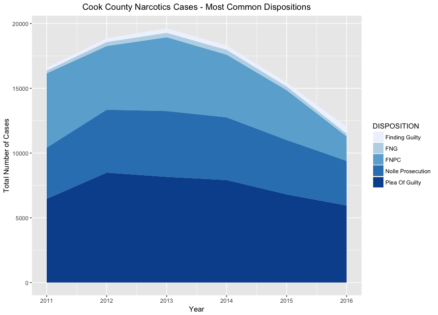

Cook County State’s Attorney Kim Foxx released a pretty amazing dataset and report on how the State's Attorney Office (SAO) had handled felony cases over the past six years. The [report itself](https://www.cookcountystatesattorney.org/sites/default/files/files/documents/ccsao-data-report-oct-2017.pdf) looks just at data from 2016, while there are a number of datasets released for data starting in 2011.

The report is pretty detailed, and provides a lot of helpful context on what the data mean and don't mean. It also provides some great visual explanations of how a case moves through the SAO - from arrest to initition to pre-trail to a disposition to sentencing. I was particularly curious about dispositions, but noticed that the "Disposition" section excluded an analysis / breakdown of narcotics cases. This post looks into how narcotics cases are treated differently, and why the report may have left those cases out of their disposition analysis.

### How Narcotics Cases are Initiated

The report notes that narcotics cases are initiated differently from all other cases. Non-narcotics cases go through either (1) Felony review (where attorneys at the SAO decide whether or not to prosecute) or (2) a grand jury. There’s a brief explanation (and helpful flowchart) of these differences on page 4 of the report. Narcotics cases, however, are filed directly by law enforcement - they do not go through felony review or a grand jury. Page 6, the "Initiations" section explains:

> Law enforcement may directly file charges in narcotics cases without FRU approval. The first time the SAO has any involvement in those cases is at preliminary hearing. In the data these are referred to as "bond set" cases.

As a result, comparing the dispositions of narcotics cases (vs. other types of cases, such as retail theft, DUIs, etc.) would therefore not be an apples-to-apples comparison.

For example, looking at all dispositions in the provided data (2011 - 2016), cases labeled as "Narcotics” led to a guilty plea just 43% of the time, compared to 75% of the time for all other types of cases. That is quite different from what I’d expect to see, since plea bargains are generally quoted to happen in the vast majority of cases. See, e.g. [this report from the Human Rights Watch](https://www.hrw.org/report/2013/12/05/offer-you-cant-refuse/how-us-federal-prosecutors-force-drug-defendants-plead) - it focuses on federal drug sentencing, but the general trend of pleas holds at the state level as well.

That suggests that we need to take a closer look at the data - there are likely more narcotics cases making to the "disposition” stage than other types of cases. I suspect this is why narcotics cases were left out of the "Disposition” section starting on page 8.

### Narcotics Dispositions

Looking at all narcotics data (years 2011 - 2016), the data start to make sense. The table below shows the most common narcotics dispositions, along with the most common dispositions for _non_-narcotics cases as well.

| Disposition        | Number of narcotics cases | % of all narcotics cases | Number of non-narcotics cases | % of all non-narcotics cases
| ------------       | ---------------           |    --------------------- | ----------------------------- | --------------------------|
| Plea Of Guilty     | 43,782                    | 43%                      | 95,049                        | 75%
| FNPC               | 26,911                    | 26%                      | 3,363                         | 3%
| Nolle Prosecution  | 26,365                    | 26%                      | 12,565                        | 10%
| Finding guilty     | 2,045                     | 2%                       | 6,567                         | 5%
| Finding not guilty | 1,735                     | 2%                       | 4,646                         | 4%

As we would expect, "Plea of Guilty” is most common. But the more interesting classifications are the next two most common - FNPC ("Finding of no probable cause”) and Nolle Prosecution (the SAO chose not to proceed). This seems to explain why we thought that narcotics cases had such a lower rate of guilty pleas. A narcotics charge does not get initiated through felony review or a grand jury, resulting in a significant number of cases being initiated that end up being dismissed (either by a finding of no probable cause, or the prosecution simply choosing not to proceed). In non-narcotics cases, more of these cases wouldn’t even reach initiation - they wouldn’t make it past a grand jury or felony review.

If we remove the "FNPC" and "Nolle Prosecution" cases, we end up seeing pretty similar plea rates in narcotics vs. non-narcotics cases. In 2016, 85% of narcotics cases ended in a guilty plea, while 82% of non-narcotics cases ended in a guilty plea.

### Dispositions over time - "Smart on Crime"
Looking at narcotics cases over time (in the 2011 - 2016 time range of the data), there was an increase in total cases from 2011 (16,709 cases) until 2013 (19,790 cases), which then significantly decreased to 12,316 cases in 2016. The below graph shows that general trend, along with the most common dispositions for these cases. This timing lines up well with Attorney General Eric Holder's ["Smart on Crime" initiative](https://www.justice.gov/archives/ag/attorney-generals-smart-crime-initiative), first announced in August of 2013. While the focus of that initiative was on federal prosecutors, my guess is that the general advice was also taken at the state level.

### Why don't narcotics cases go through felony review or a grand jury?
I’m not entirely sure why narcotics cases are eligible for "direct filing” by law enforcement, while other cases must go through a felony review or a grand jury. I tried researching this, but wasn’t able to find any explicit explanation. There is a [2012 research report on "Policies and Procedures of the Illinois Criminal Justice System](http://www.icjia.state.il.us/assets/pdf/ResearchReports/Policies_and_Procedures_of_the_Illinois_Criminal_Justice_System_Aug2012.pdf) but that lacked any reference to direct filings. Cook County’s ["Guide to the Criminal Justice System"](https://www.cookcountyil.gov/service/guide-criminal-justice-system) also doesn’t mention direct filings.

One hypothesis is that the FNPC and Nolle Prosecution outcomes are essentially the same as an attorney at the SAO rejecting a case at the "Felony review" state. But does that mean that all people charged in narcotics cases have to post bail? Even if those cases go on to be dismissed? As quoted above, the report mentions:

> The first time the SAO has any involvement in those cases is at preliminary hearing.

According to the report and to HG.org's [article on the Illinois Felony Process](https://www.hg.org/article.asp?id=5008), the preliminary hearing happens after a bond hearing. If that's the case, then "direct filing" by law enforcement seems like it would be significanly worse for defendants, who may end up sitting in jail waiting for a case that will eventually be dismissed.

It's also entirely possible that I'm mis-interpreting the process - if so, I would love to hear from someone who could explain what I'm getting wrong!